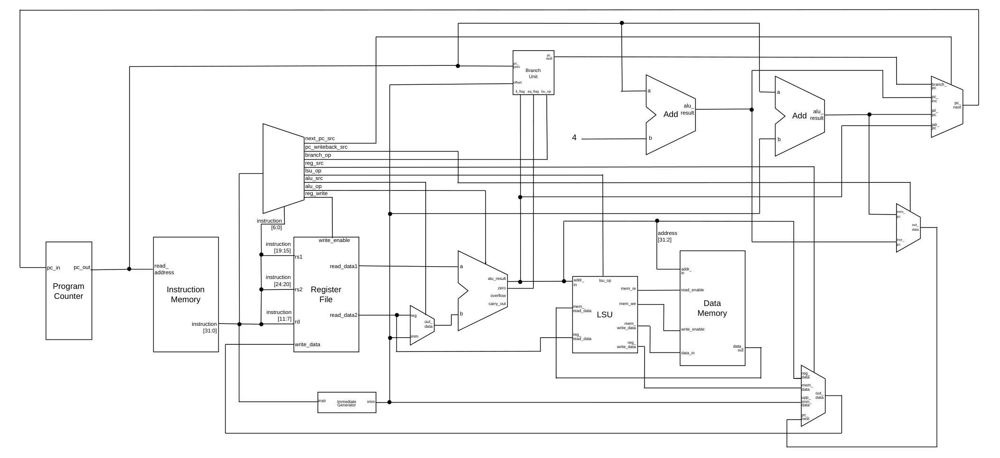
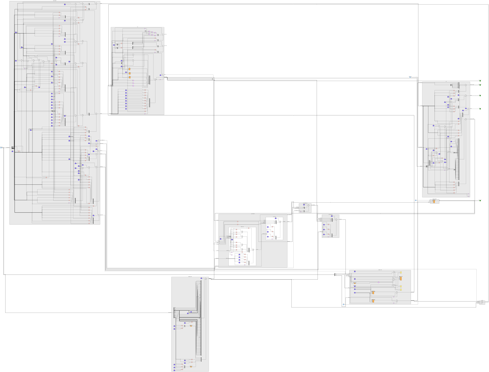

# RV32I Core Architecture

This document outlines the microarchitecture of the custom RV32I CPU core.

## Overview

The core implements the **RV32I Base Integer Instruction Set**. It utilizes a unified single-cycle datapath (or lightly pipelined depending on memory interfaces), meaning that instruction fetch, decode, execute, memory access, and writeback conceptually resolve in a single clock cycle boundary.

### Supported Instructions
*   **Arithmetic/Logic**: `ADD`, `SUB`, `AND`, `OR`, `XOR`, `SLL`, `SRL`, `SRA`, `SLT`, `SLTU` (and Immediate variants)
*   **Control Flow**: `BEQ`, `BNE`, `BLT`, `BGE`, `BLTU`, `BGEU`, `JAL`, `JALR`
*   **Memory**: `LW`, `LH`, `LHU`, `LB`, `LBU`, `SW`, `SH`, `SB`
*   **Upper Immediates**: `LUI`, `AUIPC`

*(Note: `FENCE`, `ECALL`, `EBREAK`, and CSRs are intentionally omitted in this simplified core).*

## Datapath Components

### 1. Program Counter (PC) & PC Controller
The `program_counter.v` holds the current 32-bit execution address. On every clock edge, the `pc_controller.v` determines the next PC.
*   By default, `Next PC = PC + 4`.
*   On a taken Branch or Jump, the `pc_src_mux` selects the computed target address (usually `PC + Offset` or `Reg + Offset`).

### 2. Decoder & Immediate Generator
*   **`main_decoder.v`**: The brain of the CPU. It reads the 32-bit instruction and drives all control signals (ALU operation, memory read/write enables, multiplexer selects).
*   **`immediate_gen.v`**: Extracts and sign-extends the scrambled immediate fields from I, S, B, U, and J type instructions into a clean 32-bit value.

### 3. Execution (ALU & Branch Unit)
*   **`alu.v`**: Performs arithmetic and logical operations. Inputs are selected via `alu_mux.v` (e.g., choosing between `Register 2` data and the `Immediate` value).
*   **`branch_unit.v`**: A dedicated comparison unit that evaluates branch conditions (`==`, `!=`, `<`, `>=`) and outputs a boolean signal telling the PC Controller whether to take the branch.

### 4. Memory (LSU)
*   **`lsu.v` (Load/Store Unit)**: Handles sub-word memory operations. If you request an 8-bit `LB` (Load Byte), the LSU reads the 32-bit word from `data_mem`, extracts the correct byte based on the address alignment, and sign-extends it to 32 bits for the Register File. It also generates byte-enable masks for stores (`SB`, `SH`).

### 5. Register File
*   **`register_file.v`**: Contains 32 general-purpose 32-bit registers (`x0` - `x31`).
*   `x0` is hardwired to zero.
*   Two asynchronous read ports (for `rs1` and `rs2`) and one synchronous write port (for `rd`).

## Datapath Flow (Schematic)

*(You can also view the [high-resolution PDF version here](RV32I%20Block%20Diagram.pdf))*

### Synthesized Gate-Level Schematic (Yosys)

## RV32I Instruction Encodings

The core's `main_decoder.v` and assembler rely on standard RISC-V opcodes and funct codes. Below are the encodings fully implemented by this core:

| Instruction | Type | Opcode (bin) | Opcode (hex) | Funct3 | Funct7 |
| :--- | :--- | :--- | :--- | :--- | :--- |
| **Arithmetic (R-Type)** | | `0110011` | `0x33` | | |
| `add` / `sub` | R | - | - | `000` | `0000000` / `0100000` |
| `sll` | R | - | - | `001` | `0000000` |
| `slt` | R | - | - | `010` | `0000000` |
| `sltu`| R | - | - | `011` | `0000000` |
| `xor` | R | - | - | `100` | `0000000` |
| `srl` / `sra` | R | - | - | `101` | `0000000` / `0100000` |
| `or`  | R | - | - | `110` | `0000000` |
| `and` | R | - | - | `111` | `0000000` |
| **Immediate (I-Type)** | | `0010011` | `0x13` | | |
| `addi` | I | - | - | `000` | - |
| `slli` | I | - | - | `001` | `0000000` (in `imm[11:5]`) |
| `slti` | I | - | - | `010` | - |
| `sltiu`| I | - | - | `011` | - |
| `xori` | I | - | - | `100` | - |
| `srli` / `srai` | I | - | - | `101` | `0000000` / `0100000` |
| `ori`  | I | - | - | `110` | - |
| `andi` | I | - | - | `111` | - |
| **Loads (I-Type)** | | `0000011` | `0x03` | | |
| `lb` / `lh` / `lw` | I | - | - | `000` / `001` / `010` | - |
| `lbu` / `lhu`      | I | - | - | `100` / `101` | - |
| **Stores (S-Type)** | | `0100011` | `0x23` | | |
| `sb` / `sh` / `sw` | S | - | - | `000` / `001` / `010` | - |
| **Branches (B-Type)**| | `1100011` | `0x63` | | |
| `beq` / `bne`      | B | - | - | `000` / `001` | - |
| `blt` / `bge`      | B | - | - | `100` / `101` | - |
| `bltu` / `bgeu`    | B | - | - | `110` / `111` | - |
| **Jumps (J/I-Type)** | | | | | |
| `jal`  | J | `1101111` | `0x6F` | - | - |
| `jalr` | I | `1100111` | `0x67` | `000` | - |
| **Upper Immediates**| | | | | |
| `lui`  | U | `0110111` | `0x37` | - | - |
| `auipc`| U | `0010111` | `0x17` | - | - |
